

<!-- *page_number: true -->

 

Introduction : le Machine Learning
==

 

### Présentation partagée sous la licence Apache 2.0

---

<!-- *page_number: true -->

Grandes catégories d’algorithmes de machine learning 
-

<!-- -->

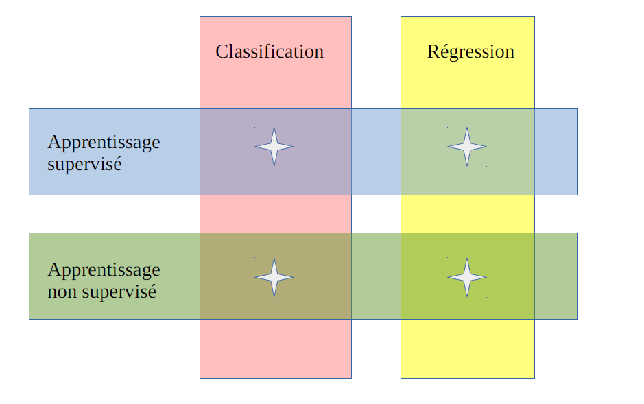 

---
<!-- *page_number: true -->

Classification / Régression
-

  
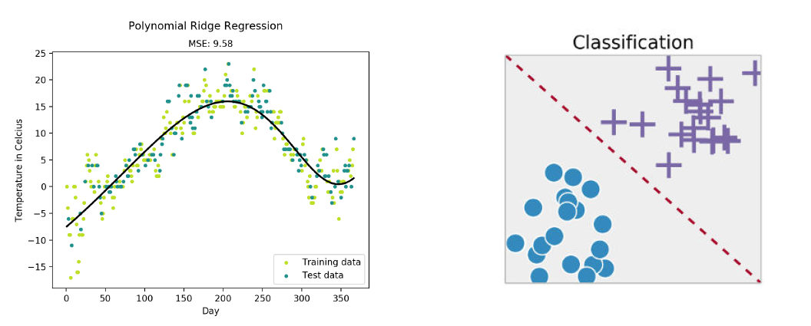

|Régression   |Classification|
|:---:|:---:|
|Prédire une variable quantitative|Prédire une classe (qualitative, discrète)|

---
<!-- *page_number: true -->

Apprentissage supervisé / non supervisé
--

<!-- -->

  
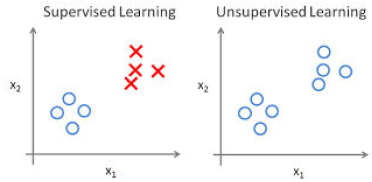

#### ■ Apprentissage supervisé :

* Nécessite un jeu d’entraînement X, y
  * X : prédicteurs
  * y : variable à prédire

#### ■ Apprentissage non supervisé :

*  Nécessite un jeu d’entraînement X

* Application principale : le clustering

* Exemple : classer des situations météo en groupes homogènes

---

<!-- *page_number: true -->

#### Une première méthode de Machine Learning : la régression linéaire

---
<!-- *page_number: true -->

La régression linéaire
--

#### ■ Exemple : prévoir le prix de vente des maisons en fonction de leur taille

#### ■ Méthode d’apprentissage supervisé :

* Un jeu d’entraînement X, y

* X : la taille des maisons

* y : le prix

---
  
<!-- *page_number: true -->

## Trouver la droite qui se rapproche le plus du nuage de points

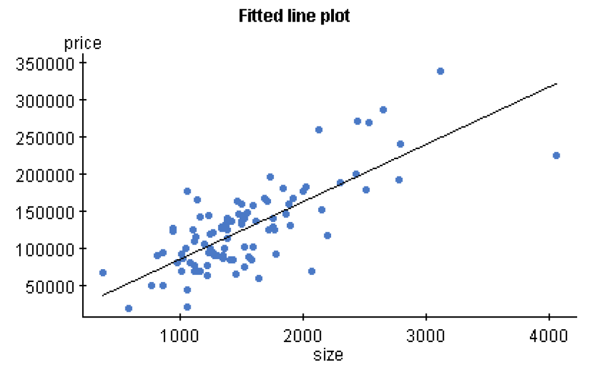

---

  
<!-- *page_number: true -->

## La régression linéaire : fonction de coût

#### ■ Comment définir la « meilleure » droite ?

#### ■ La « meilleure » droite est celle qui minimise la fonction de coût.

---

<!-- *page_number: true -->

## La fonction de coût

#### ■ Soit x,y un échantillon du jeu d’entraînement
*  x = taille de la maison
*  y = prix de la maison

#### ■ Soit h(x) notre prédiction : h(x) = w0.x + w1

#### ■ Une fonction de coût possible :

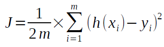

m étant le nombre d’échantillons dans le jeu d’entraînement.

#### ■ C’est l’écart quadratique moyen entre les prédictions et la vérité terrain

---

  
<!-- *page_number: true -->
  
## Comment trouver le minimum de la fonction de coût ?

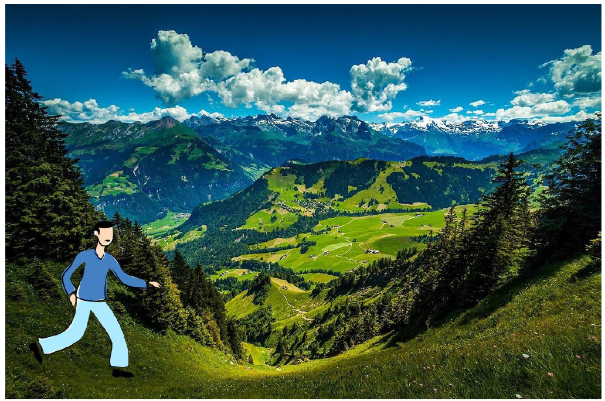

---

<!-- *page_number: true -->

## Comment trouver le minimum de la fonction de coût ?

#### ■ La descente de gradient

---
  
<!-- *page_number: true -->

## Application à la régression linéaire Calcul du gradient

#### ■ Application à la régression linéaire

  
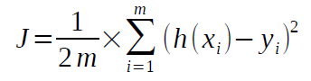

Avec h(x) = w0.x + w1 

#### ■ Gradient :

  
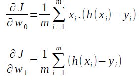

---
  
<!-- *page_number: true -->

## C’est parti, on dévale la pente

#### ■ Répéter autant de fois que nécessaire :

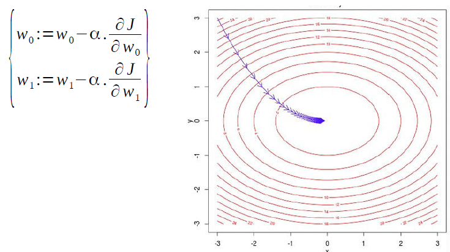

#### ■ α est le coefficient d’apprentissage (learning rate)

---
  
<!-- *page_number: true -->

## La convergence en images

<https://www.youtube.com/watch?v=1hGsKphwC-A> 

---
  
<!-- *page_number: true -->

## Influence du learning rate

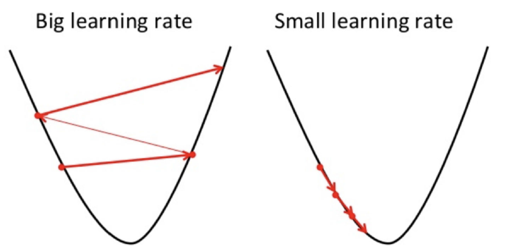

---
  
<!-- *page_number: true -->

## Et si le jeu de données est très gros ?

#### ■ Rappel calcul des gradients pour la régression linéaire :

####  ■ Si m est très grand et X de dimension élevée, alors calculer la somme devient très long, voire interminable...

#### ■ Exemple : 1 million d’images en 1024x1024

##### 
PROBLEME...

---
  
<!-- *page_number: true -->
  
## La descente de gradient stochastique

#### ■ La solution : la descente de gradient stochastique

#### ■ A chaque étape de descente de gradient, au lieu de prendre l’ensemble des échantillons d’un coup comme ceci :

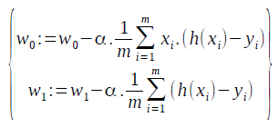

#### on itère sur les échantillons un par un :

  
pour i allant de 1 à m, répéter :

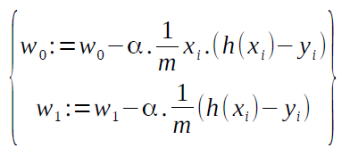

---

<!-- *page_number: true -->
  
## Illustration

|Full batch gradient descent (FBGD)|Stochastic gradient descent (SGD)|
|:---:|:---:|
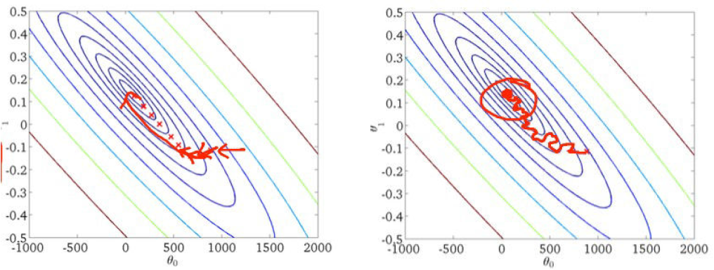

---

<!-- *page_number: true -->

## Démo en images

 <https://www.youtube.com/watch?v=HvLJUsEc6dw>

---

<!-- *page_number: true -->

## Mini-batch

#### ■ Full batch gradient descent : on calcule le gradient sur l’ensemble du jeu de données
* Inconvénient : beaucoup trop long sur gros jeu de données

#### ■ SGD : on estime le gradient échantillon par échantillon
* Inconvénient : lent et convergence plus chaotique

#### ■ Compromis : mini-batch gradient descent

* On estime le gradient sur k échantillons à la fois (par exemple 32 échantillons)

##### 
 C’est la méthode utilisée en pratique  

---
  
<!-- *page_number: true -->

## La notion d’epoch

#### ■ Dans la SGD, on estime le « gradient » échantillon par échantillon, ou par mini-batches de quelques échantillons

* Une passe complète sur le jeu de données s’appelle : 

  
 
 
 

#### ■ Le nombre d’épochs est donc le nombre de passes effectuées sur le jeu d’entraînement lors de l’apprentissage.

---
  
<!-- *page_number: true -->

## 
  Des questions sur la descente de gradient ? 

---
  
<!-- *page_number: true -->

## Hyper-paramètres – comment « régler » un modèle de Machine Learning

#### ■ Que peut-on modifier dans un modèle de Machine Learning ?

― Le type et la complexité du modèle

* La régression linéaire est un modèle simple, mais on peut le complexifier : polynôme de degré n, random forest, réseaux de neurones...

― Certains paramètres spécifiques du modèle

* Pour un réseau de neurones : nombre de couches et nombre de neurones par couche...

― Le learning rate

― La taille des mini-batches

#### ■ Comment choisir ces hyper-paramètres ?

---
  
<!-- *page_number: true -->

## Evaluer le modèle
Première idée : choisir les hyper-paramètres qui fonctionnent le mieux sur le jeu d’entraînement

##### Pas bon. Le modèle risque de ne pas être capable de généraliser.

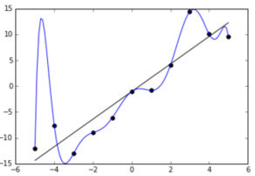

---

<!-- *page_number: true -->

## Evaluer le modèle

Deuxième idée : choisir les hyper-paramètres qui fonctionnent le mieux sur un jeu de test

##### 
 Pas bon. Aucune garantie que l’algorithme fonctionnera bien sur de nouvelles données. 
 

---

<!-- *page_number: true -->

## Evaluer le modèle

Troisième idée : entraîner sur le jeu d’entraînement, choisir les hyper-paramètres qui fonctionnent le mieux sur un jeu de validation, puis une fois le modèle réglé, l’évaluer sur un jeu de test.

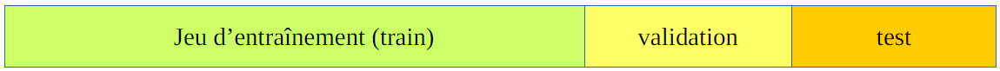

##### 
 C’est mieux ! 

---
  
<!-- *page_number: true -->

## Sous-apprentissage - Sur-apprentissage

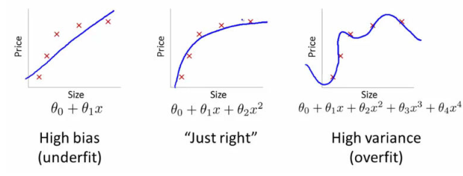

|Sous-apprentissage|Bon modèle|Sur-apprentissage|
|:---:|:---:|:---:|
|modèle trop simple pour expliquer la variance||modèle qui colle trop au bruit du jeu de données |

---
  
<!-- *page_number: true -->
  
## Sous-apprentissage - Sur-apprentissage

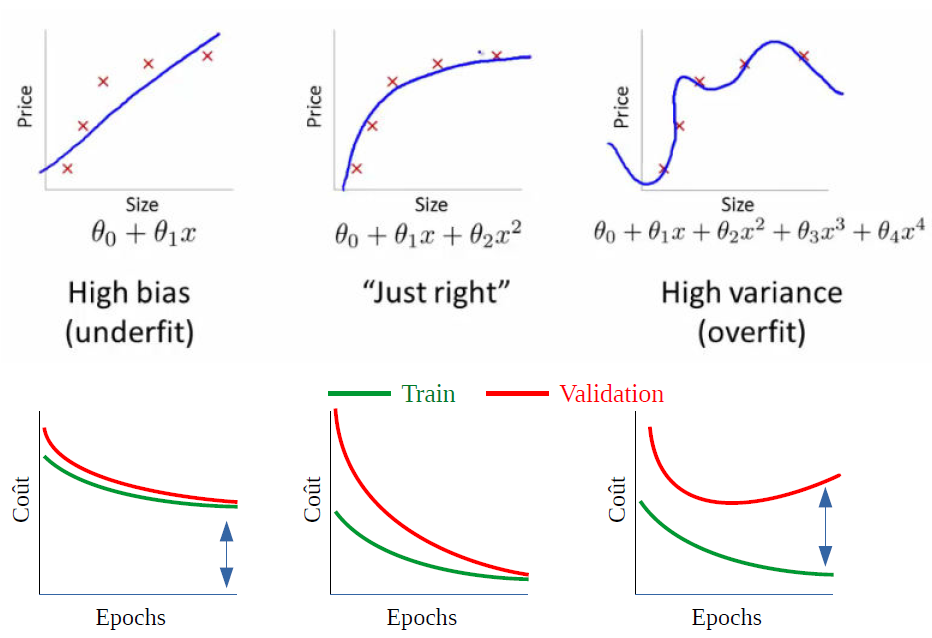

---
  
<!-- *page_number: true -->

## Combattre l’underfitting

#### ■ Combattre l’underfitting

― Complexifier le modèle

 * Ex : modèle quadratique au lieu d’un modèle linéaire pour prédire le prix des maisons

 ―   Ajouter des prédicteurs

 * Ex : il existe d’autres paramètres que la taille qui influent sur le prix des maisons. Par exemple le nombre de chambres, la distance au centre-ville...

---

<!-- *page_number: true -->

## Combattre l’overfitting

#### ■ Combattre l’overfitting
― Ajouter des données d’entraînement

 *  Ex : deux exemples de maisons ne permettent pas de créer un modèle qui généralise bien

― Simplifier le modèle ou retirer des prédicteurs

 *  Eviter que le modèle parvienne à « apprendre par coeur » le jeu d’entraînement

― Entraîner le modèle moins longtemps

 *  En français, l’overfitting se dit « surapprentissage ». Donc évitons au modèle de surapprendre.

― Limiter la capacité d’apprentissage du modèle

 * Il existe plusieurs méthodes dont la régularisation et le dropout.

― Utiliser des ensembles

 * C’est comme en météo. Entraîner plusieurs modèles et combiner leurs prédictions.

---

<!-- *page_number: true -->

## 
 Des questions? 
 

