

<!-- *page_number: true -->

 

Introduction au Deep Learning
=

 

### Présentation partagée sous la licence Apache 2.0

---

<!-- *page_number: true -->

# Le Deep Learning 

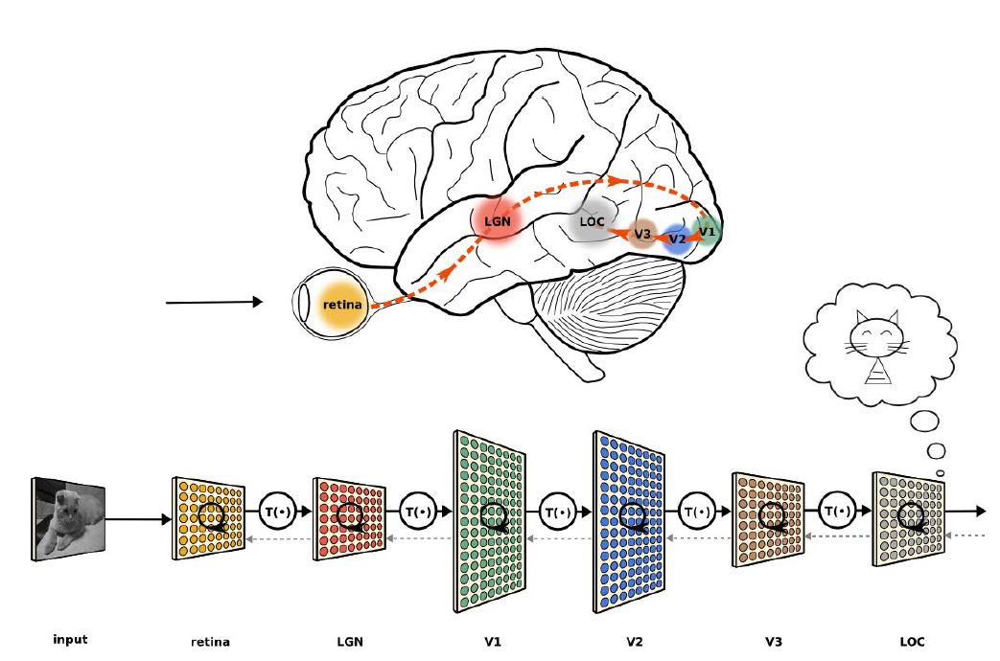

---

<!-- *page_number: true -->

## Un neurone
 
 

 
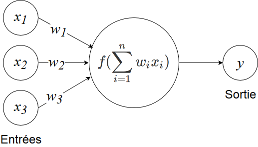 
 

* *f* est la fonction d'activation
* Question : quelle fonction *f* choisir pour retrouver le modèle linéaire ?

---

<!-- *page_number: true -->

## Fonctions d'activation couramment utilisées

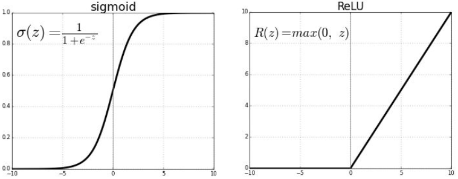

|Utilisation : à mettre en fin de réseau pour prédire une probabilité (entre 0 et 1) |Utilisation : entre chaque couche pour dé-linéariser (à coût de calcul faible)|
|:---:|:---:|

---

<!-- *page_number: true -->

## D'autres fonctions d'activation 

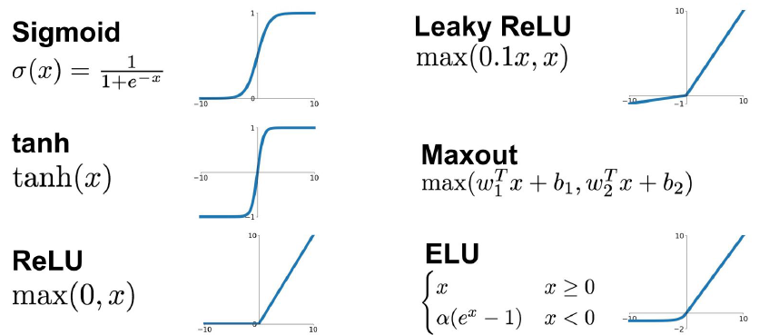 

---

<!-- *page_number: true -->

## Les couches / layers 

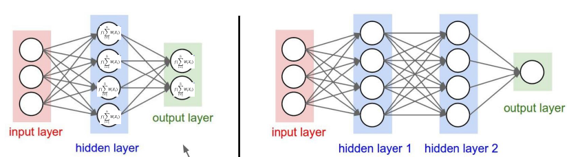

##### profondeur = 1 &nbsp;&nbsp;&nbsp;&nbsp;&nbsp;&nbsp;&nbsp;&nbsp;&nbsp;&nbsp;&nbsp;&nbsp;&nbsp;&nbsp;&nbsp;&nbsp;&nbsp;&nbsp;&nbsp;&nbsp;&nbsp;&nbsp;&nbsp;&nbsp;&nbsp;&nbsp;&nbsp;&nbsp;&nbsp;&nbsp; profondeur = 2 

---

<!-- *page_number: true -->

## Intuition

Un réseau de neurones peut approcher n'importe quelle fonction continue.

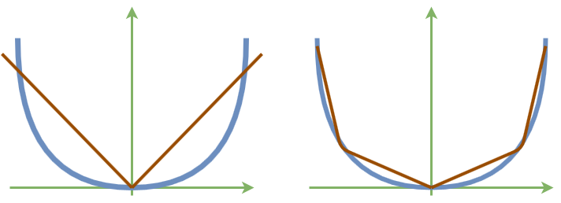

Couche cachée à 2 neurones &nbsp;&nbsp;&nbsp; Couche cachée à 4 neurones

---

<!-- *page_number: true -->

## Classifier une image avec un réseau de neurones sans couche cachée

+ Objectif : classifier une image 32x32 en 10 classes

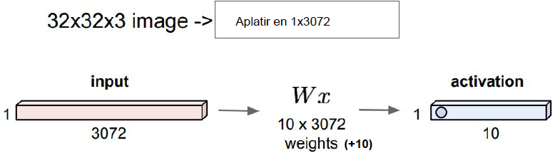

+ Plus de 30 000 paramètres pour un petit réseau et une petite image 
+ Explose avec la résolution de l'image et la complexité du réseau

---

# Réseaux de neurones convolutionnels

<!-- *page_number: true -->

---

<!-- *page_number: true -->

## Convolution sur une image 

 
  
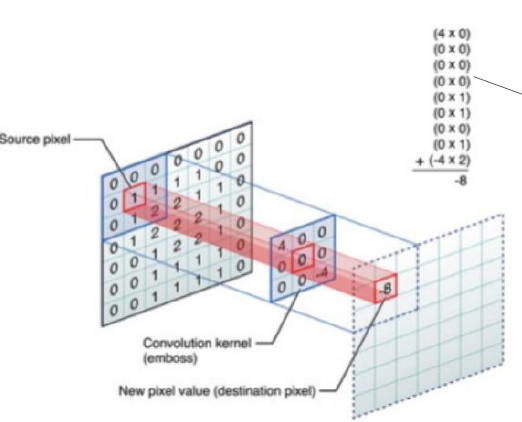

+ Multiplication pixel par pixel (produit scalaire)

---

<!-- *page_number: true -->

## Convolution sur une image 

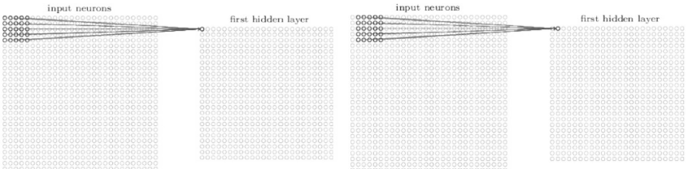

- 1 filtre 5x5

- Exemple en images : <http://setosa.io/ev/image-kernels/>

--- 

<!-- *page_number: true -->

## Autres types de couches 

 
- MaxPooling

- DropOut

---

<!-- *page_number: true -->

## Max Pooling : Réduire la dimension

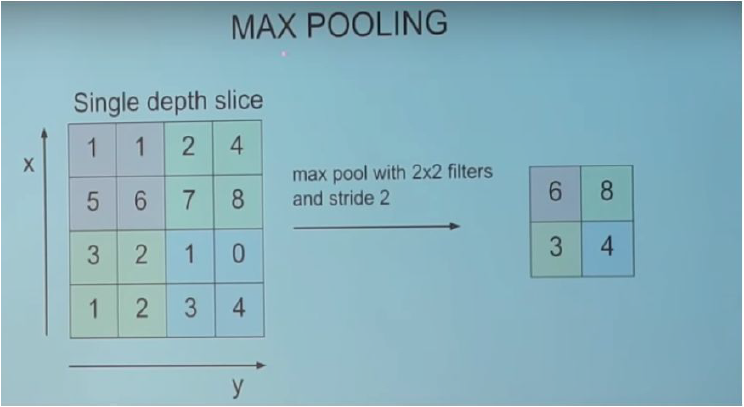

---

<!-- *page_number: true -->

## Dropout : supprimer aléatoirement des neurones 

 Méthode de régularisation 

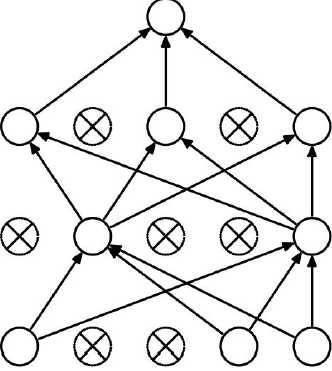

---

<!-- *page_number: true -->

## Exemple de réseau convolutionnel complet 

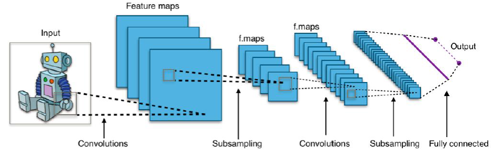

