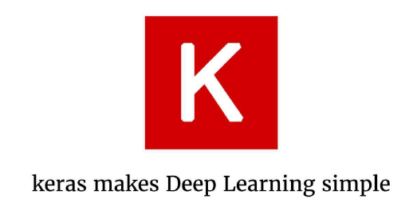
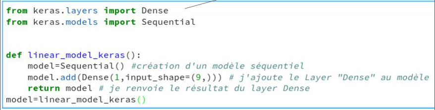
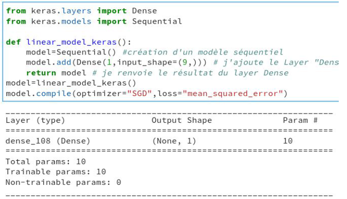
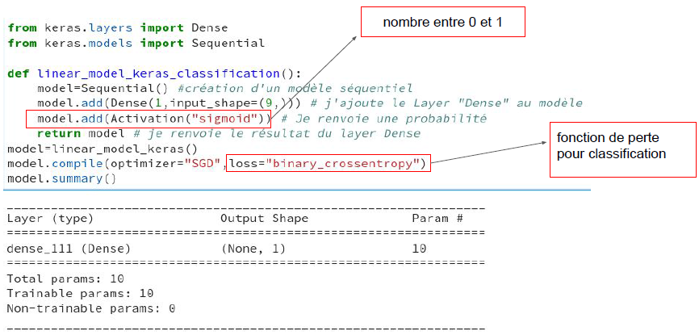
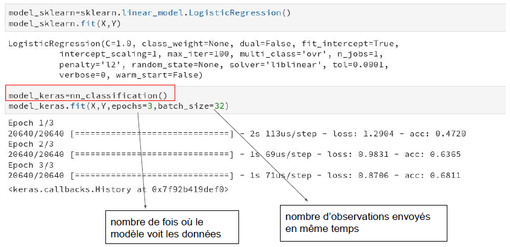
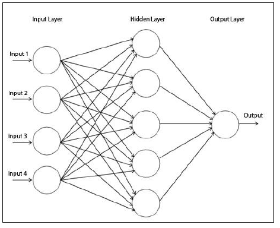
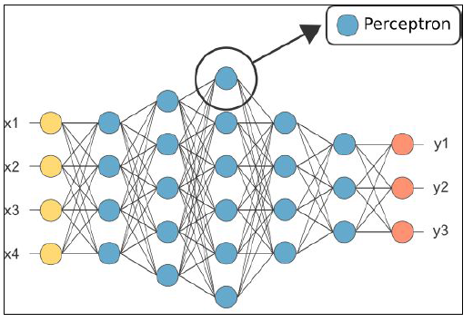
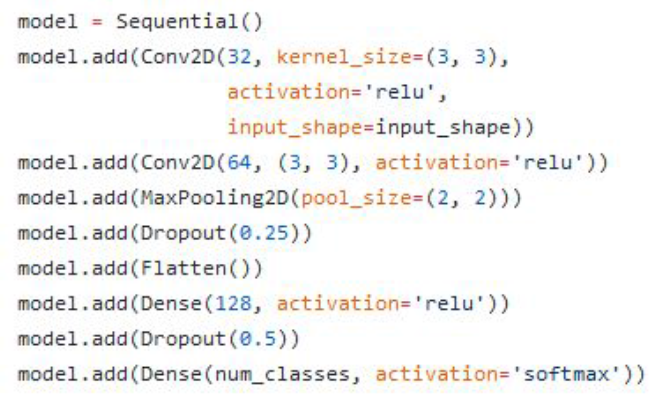
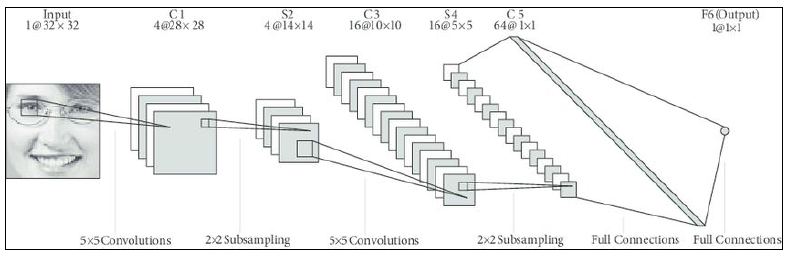
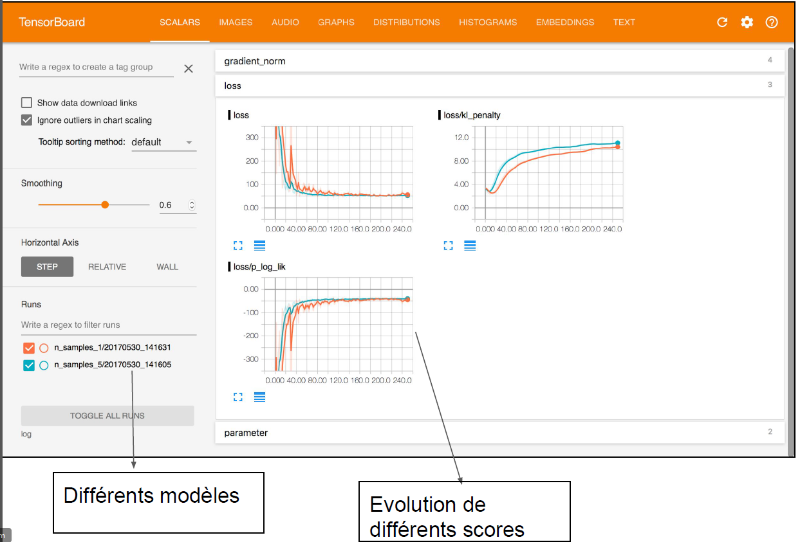

 

 

<!-- *page_number: true -->

La Librairie Keras
==

 

### Présentation partagée sous la licence Apache 2.0

---

<!-- *page_number: true -->

## La Librairie Keras : La librairie du Deep learning

<http://keras.io/>

 

 

---
  
<!-- *page_number: true -->

## Keras : une librairie de haut niveau pour concevoir vos modèles de Deep Learning

■ TensorFlow, PyTorch : librairies de plus bas niveau
 * Utiles pour des chercheurs en informatique

■ Keras : une librairie pour praticiens

 

---
  
<!-- *page_number: true -->

## Quand utiliser Keras ?

■ Différences entre Keras et scikit-learn:
*  Keras :
   *  flexibilité dans la création d'architecture des réseaux de neurones
   *  utilisation du GPU

■ Quand utiliser Keras au lieu de scikit-learn?
* Dès qu’on veut faire du Deep Learning (réseaux de neurones profonds)

 

---
  
<!-- *page_number: true -->

## Le modèle linéaire sur Keras

* Le paramètre 1 de “Dense” correspond au nombre de modèles linéaires que je vais créer.
* Le nombre de paramètres en sortie de la couche Dense est égal au nombre de modèles linéaires que je vais créer.
* Ici, pour obtenir un modèle linéaire, je choisis simplement le paramètre 1.

---

<!-- *page_number: true -->

## Exemples de Layers (couches) Keras

* Convolution : Conv2D

* Fonction d’activation : Activation (relu, sigmoid , tanh, etc.. )

* Dropout : Dropout

* Combinaison linéaire : Dense

---
  
<!-- *page_number: true -->

## Le modèle linéaire sur Keras

* Rappel : sous scikit-learn, le modèle linéaire est déjà implémenté

* Sur Keras, on peut implémenter le modèle linéaire comme cas particulier du Layer “Dense”.

* En effet, le modèle linéaire est équivalent à un neurone sans fonction d'activation.
 
*
f(x)=Ax+b
*
  
---
  
<!-- *page_number: true -->

## Régression linéaire avec le code Keras

  

---
 
<!-- *page_number: true -->

## Régression logistique avec le code Keras

---
  
<!-- *page_number: true -->

## Librairie scikit-learn comparée à la Librairie Keras

---
  
<!-- *page_number: true -->

## Exercice 1 

#### Ecrivez le code Keras correspondant à ce réseau de neurones. 

 

 

---
  
<!-- *page_number: true -->

## Exercice 2 

#### Ecrivez le code Keras correspondant à ce réseau de neurones. 

 

 

---
  
<!-- *page_number: true -->

## Exercice 3 

#### Dessinez l’architecture correspondante

---
  
<!-- *page_number: true -->

## Exercice 4 

#### Donnez le code Keras correspondant à ce réseau de neurones. 

---
  
<!-- *page_number: true -->

## Visualisation de l’entrainement :

---

<!-- *page_number: true -->

## 
 Questions ? 
 

