

 

<!-- *page_number: true -->

# Exemples d'architectures de réseaux convolutionnels

 

### Présentation partagée sous la licence Apache 2.0

---

<!-- *page_number: true -->

## Schema réseau convolutionnel

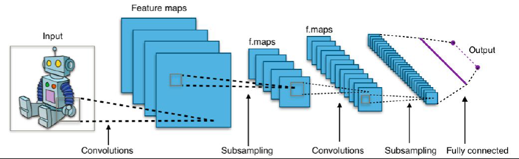

---
  
<!-- *page_number: true -->

## ImageNet : Présentation

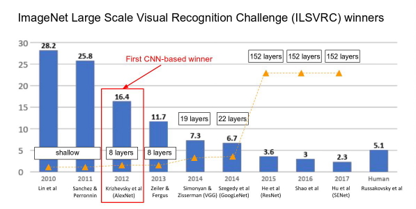

---
  
<!-- *page_number: true -->

## LeNet : pionnier des réseaux convolutionnels

* peu de convolutions
* peu de couches

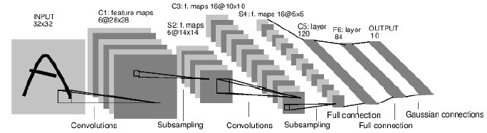

---

<!-- *page_number: true -->

## LeNet : Code Keras

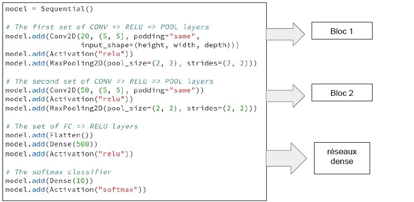

---
  
<!-- *page_number: true -->

## Réseau AlexNet

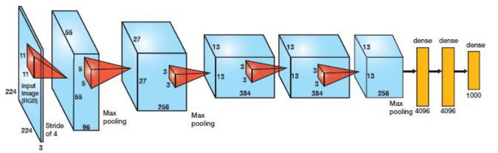

Réseau convolutionnel suivi
d’un réseau dense

Gagnant ImageNet 2012

---

<!-- *page_number: true -->

## AlexNet sur Keras

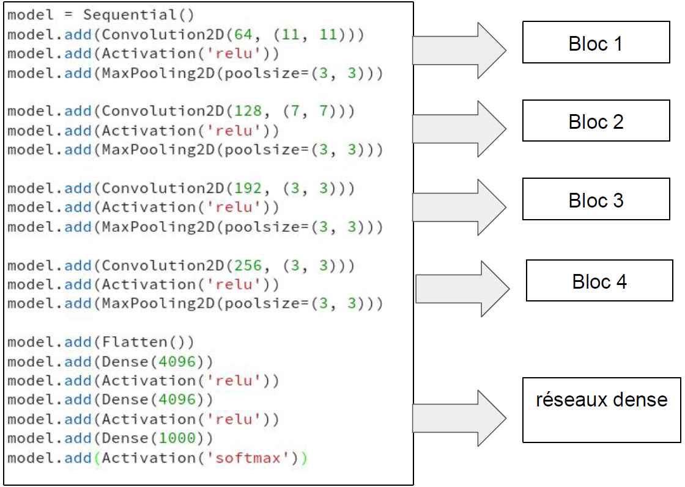

---

<!-- *page_number: true -->

## Réseau VGG

  
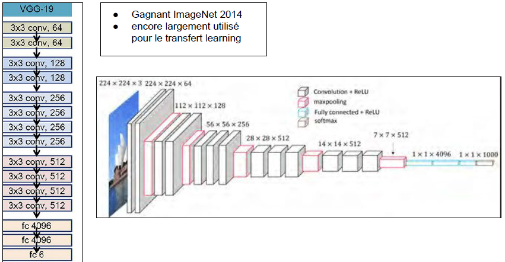

---

<!-- *page_number: true -->

## VGG sur Keras

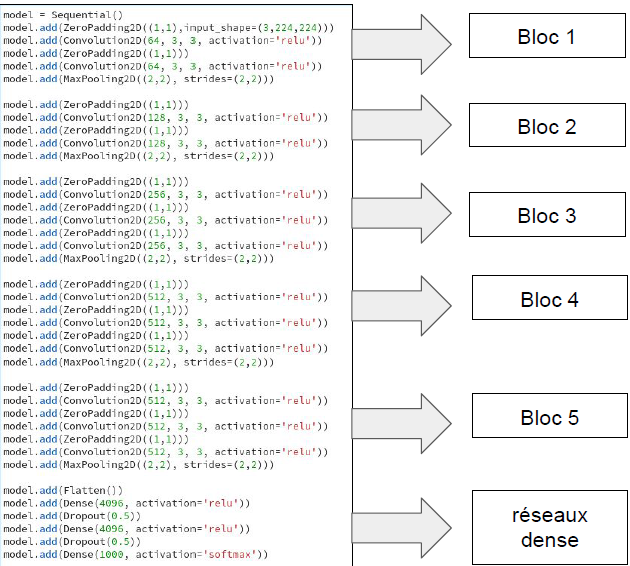

---

<!-- *page_number: true -->

## Détection d’objet en temps réel (Yolo)
 <https://www.youtube.com/watch?v=MPU2HistivI>

* Trouver tous les objets de l’image
* Classifier chaque objet 

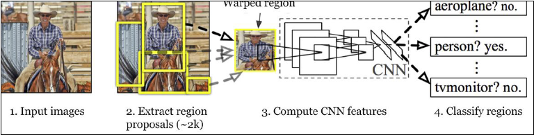 

---
  
<!-- *page_number: true -->

## Unet: Classification par pixel

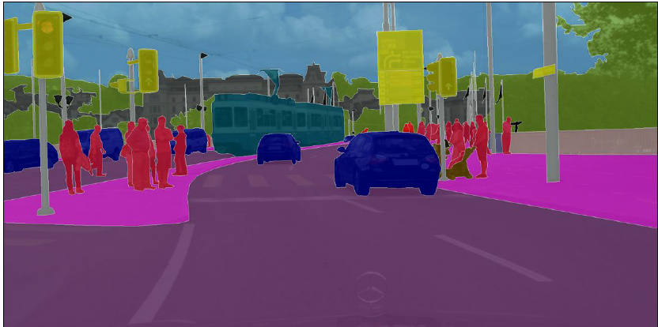

---

<!-- *page_number: true -->

## U-net: Classification par pixel

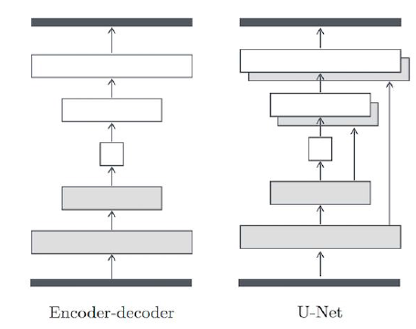

 -Encoder l’image à différentes
échelles 

 -Extraire les informations de
chaque échelle

---

<!-- *page_number: true -->

## Super Resolution

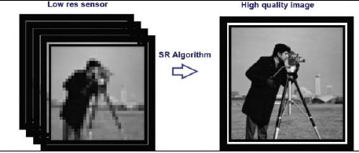

 -En entrée : images basses résolution
 
 -En sortie : images hautes résolution

---

<!-- *page_number: true -->

## Super Resolution

---
  
<!-- *page_number: true -->

## ResNet : Estimer les résidus

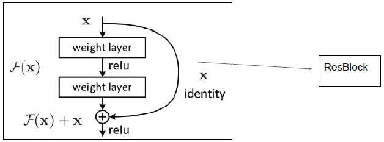

---

<!-- *page_number: true -->

## ResNet : Estimer les résidus

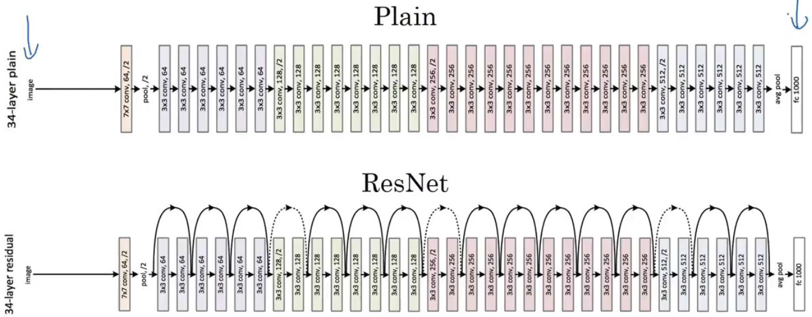

 -Convergence rapide
 
 -Apprend plus de détails

---

<!-- *page_number: true -->

## Inception v3 : l'un des meilleurs classificateur (Pourquoi ?)

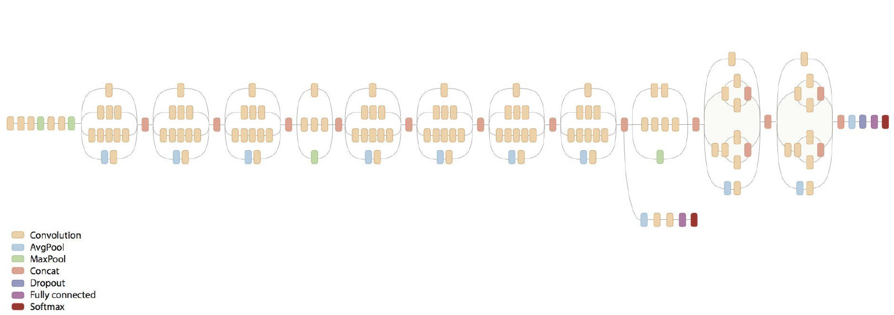

---

<!-- *page_number: true -->

# 
 Travaux récents en deep learning 

---

<!-- *page_number: true -->

## Deep painterly harmonization

* utilise un VGG pré-entrainé

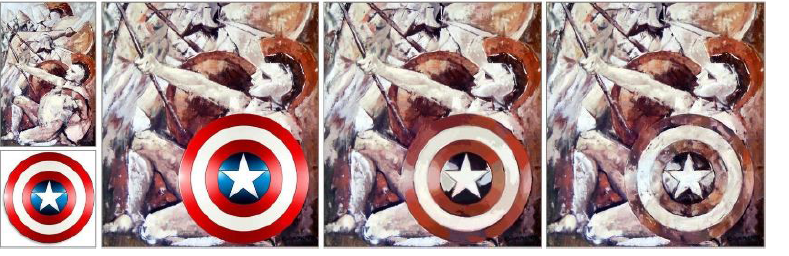

|copier/coller de la première image sur la seconde| image avant l'application des  CNNs |image après l'application des CNNs|
|:--:|:--:|:--:|

---

<!-- *page_number: true -->

## Exemples

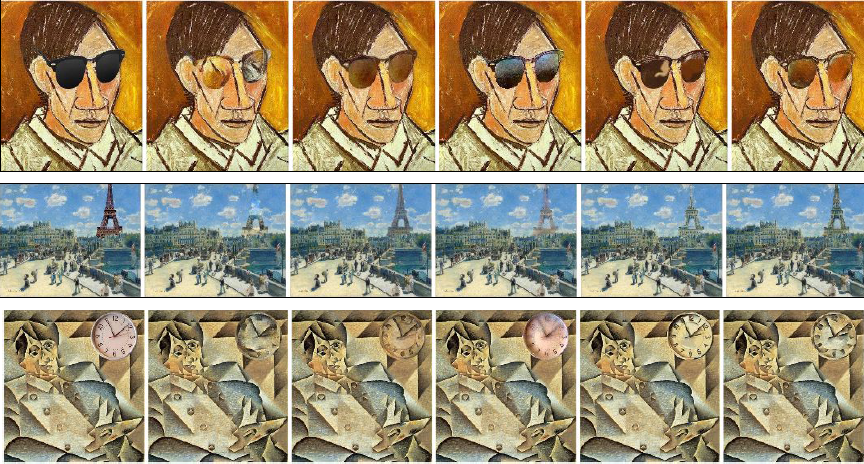

---

<!-- *page_number: true -->

## Célébrités

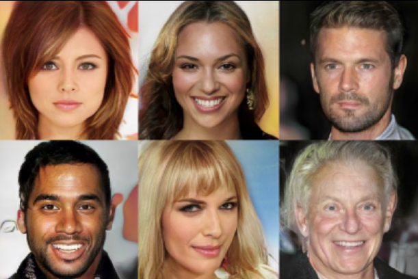

Reconnaissez-vous ces célébrités ?

---

<!-- *page_number: true -->

## Célébrités

Ces célébrités ont été inventées par des réseaux de neurones !

(Generative Adversarial Network - GAN)

---
 
<!-- *page_number: true -->

## Generative Adversarial network

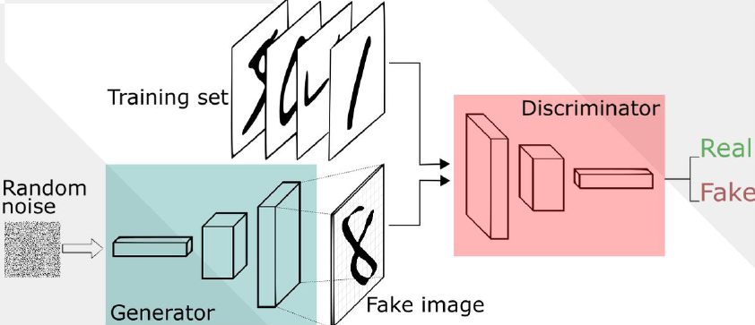

---
  
<!-- *page_number: true -->

