

<!-- *page_number: true -->

 

# Réseaux de neurones récurrents 

 

### Présentation partagée sous la licence Apache 2.0

---

<!-- *page_number: true -->

## Rappels 

■ Réseaux convolutionnels : traiter la dimension spatiale

* Hypothèse : des pixels voisins représentent des choses similaires
* Convolution : Connexion locale des pixels (voisinage) pour détecter des objets plus gros (lignes/courbes) 

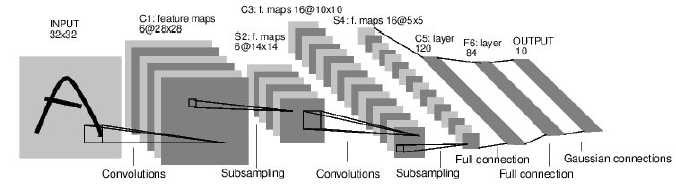

■ Réseaux récurrents : Traiter la dimension temporelle ? 

---
  
<!-- *page_number: true -->

## Série Temporelles 

Selon Wikipédia :
*Les séries temporelles sont considérées à tort comme étant une branche exclusive de l'économétrie. Cette dernière est une discipline qui est relativement jeune alors que les séries temporelles ont été utilisées bien avant par exemple en astronomie (1906) et en météorologie (1968).*

* L'objet des séries temporelles est l'étude des variables au cours du temps 

Exemples : 

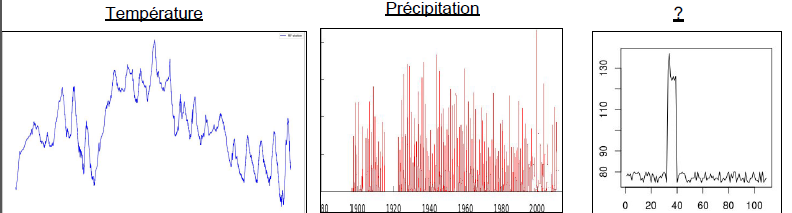 

---

<!-- *page_number: true -->

## Apprentissage avec des séries temporelles

■ Classification 

* Identifier les épisodes pluvieux/non pluvieux 
* Identifier si une personne fait du sport, dort, etc ... 
* Identifier si une station météo est défaillante.

■ Regression 

* Prédire la température maximale de la journée 
* Prédire la quantité de pluie attendue
* Corriger la température mesurée

---

<!-- *page_number: true -->

## Les différents types de RNN 

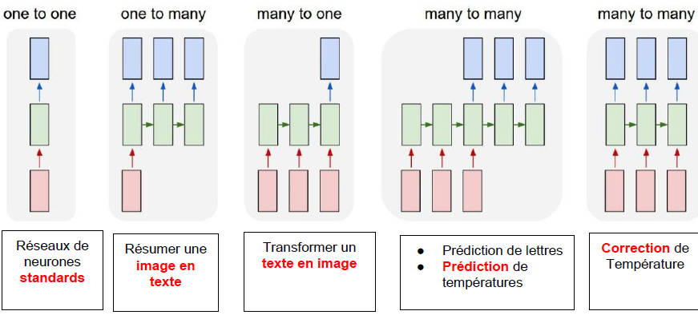 

---

<!-- *page_number: true -->

## Exemple : prédiciton de lettre 

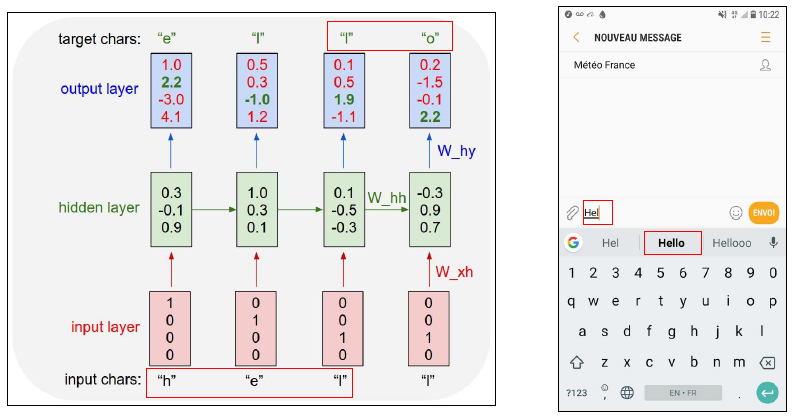

---
  
<!-- *page_number: true -->

## Exemple : prédiction de lettre 

Première période : Réseau de neurone classique
  
* La couche cachée est appélée "cellule"
* Il y a une sortie par période 

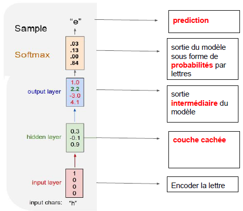

---
  
<!-- *page_number: true -->

## Exemple : prédiction de lettres

Périodes suivantes - réseau de neurone presque classique :
* la couche intermédiaire a une entrée supplémentaire : la sortie intermédiaire du réseau précédent

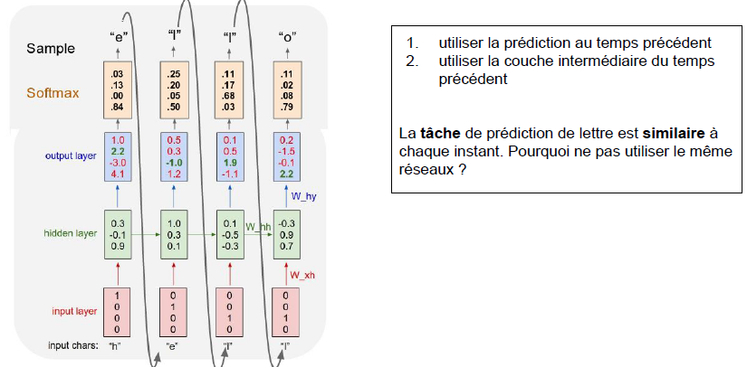

---

<!-- *page_number: true -->

## Représentation en graphe 

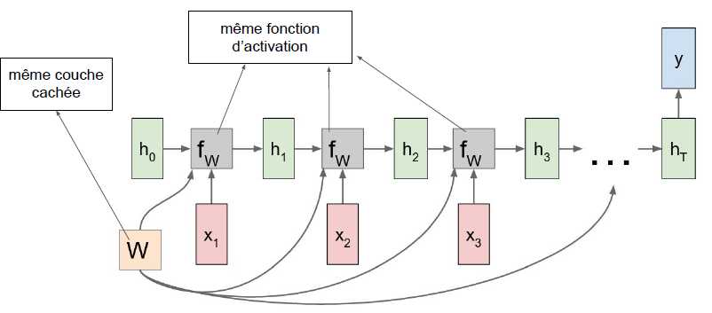 

---
 
<!-- *page_number: true -->

## Représentation enroulée

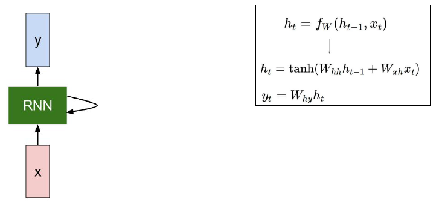 

---

<!-- *page_number: true -->

## Autres exemples : Générer du Shakespeare 

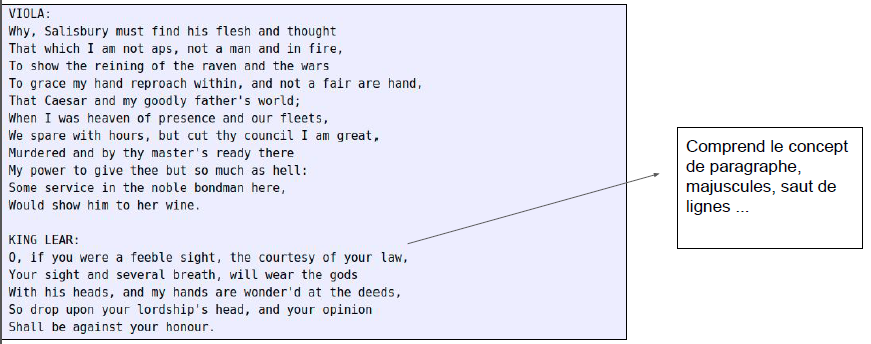 

* Entraînement : tous les textes de Shakepeare
* Puis on donne au réseau une première lettre, et il prédit la suite 

---

<!-- *page_number: true -->

## Autres exemples : générer du code LaTex 

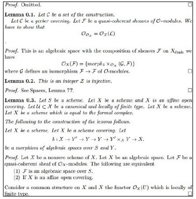 

* Le réseau tente de démontrer les lemmes 

* Il reproduit la structure d'un cours de maths

* Mais ça ne veut rien dire !

---

<!-- *page_number: true -->

## Étude de cas NetAtmo 

 

---

<!-- *page_number: true -->

## Étude de cas NetAtmo 

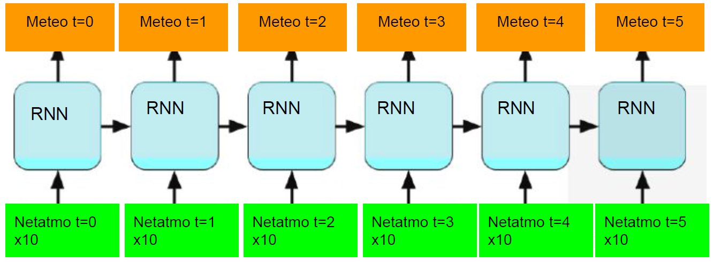 

---

<!-- *page_number: true -->

## Étude de cas NetAtmo 

#### Objectif : deviner la courbe bleue (Météo-France) à partir des autres courbes (NetAtmo) 

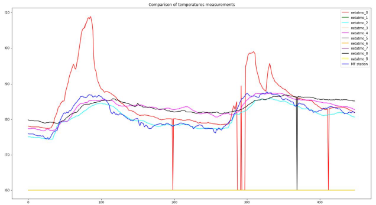 

---
 
<!-- *page_number: true -->

## Étude de cas NetAtmo 

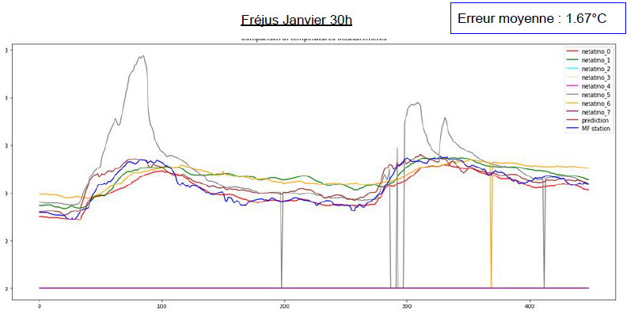 

* La prédiciton est robuste aux pics anormaux de températures des stations NetAtmo (grises) 

--- 

<!-- *page_number: true -->

## Bonus : code Keras 

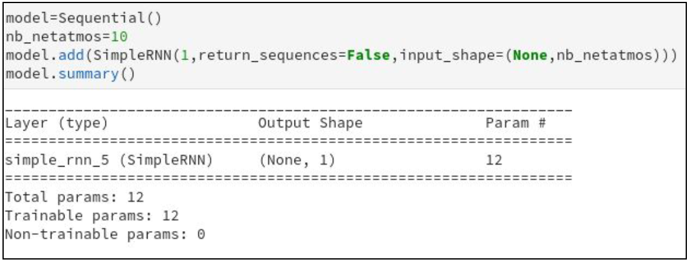 

* le paramètre return_sequences permet de spécifier si on veut uniquement la sortie de la dernière période (False) ou toute la séquence y compris périodes intermédiaires (True).

