

<!-- *page_number: true -->

 

# Python pour le Machine Learning 

 

### Présentation partagée sous la licence Apache 2.0

---

<!-- *page_number: true -->

## Part de marché chez les data scientists par langage

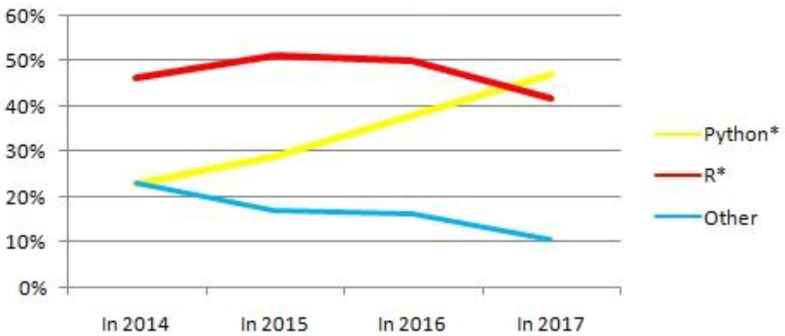

---
  
<!-- *page_number: true -->

## Librairies Pythons 

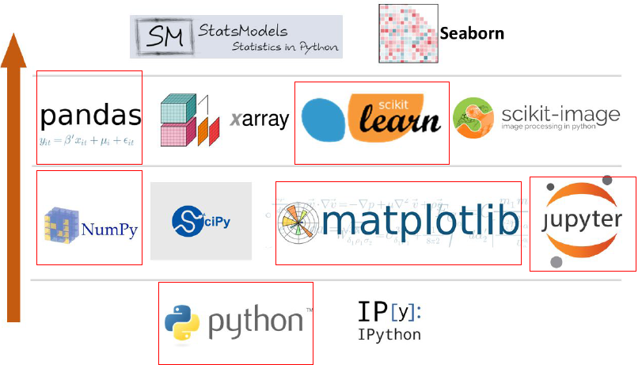

---
 
<!-- *page_number: true -->

## Lire des fichiers Excel : utilisation de la Librairie Pandas 

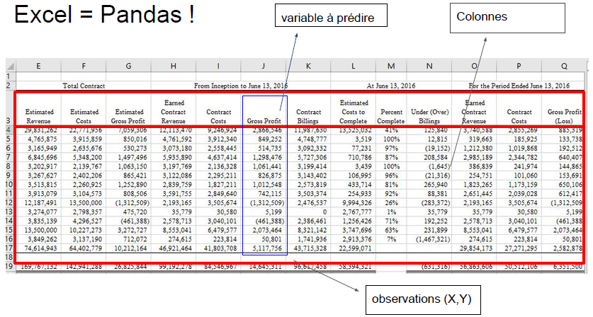

---
  
<!-- *page_number: true -->

## Importer un fichier Excel avec Pandas

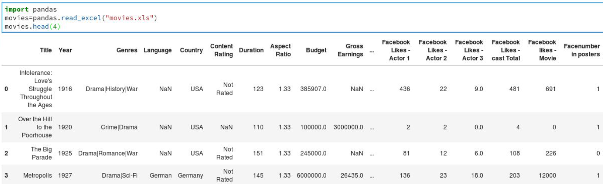

---
  
<!-- *page_number: true -->

## Importer un fichier csv avec Pandas

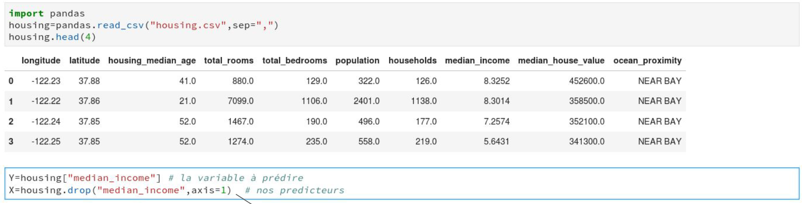

*  Préparation du jeu de données (X,Y) pour le modèle

---
  
<!-- *page_number: true -->

## Utilisation de Pandas pour vérifier les données

###### ● Les données contiennent-elles des valeurs aberrantes ? (ex : une température de 6000 degrés)

###### ● Y a-t-il des valeurs manquantes ?

##### Exemple de code sur le dataframe housing:

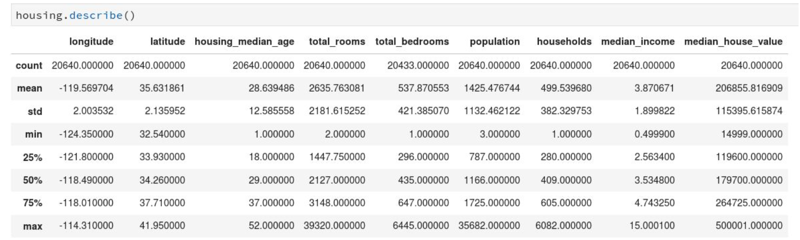

---
  
<!-- *page_number: true -->

## Utilisation de Pandas pour vérifier les données

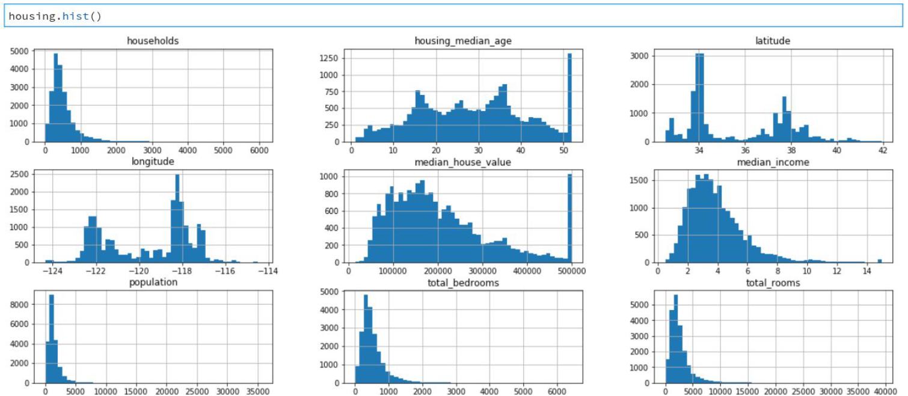

---
  
<!-- *page_number: true -->

## Présentation de Sklearn

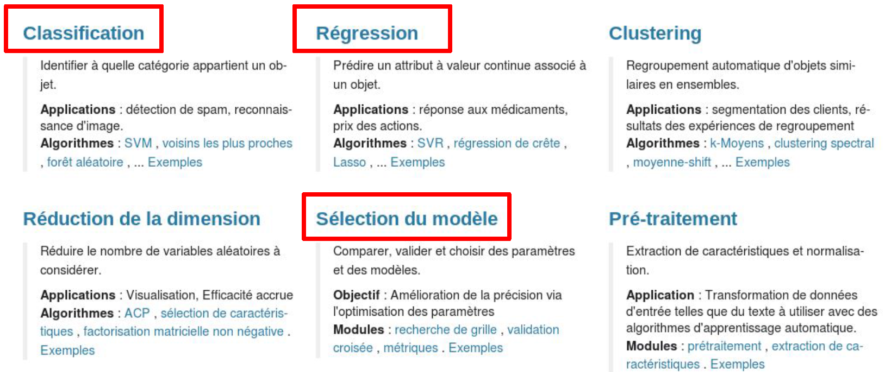

---
  
<!-- *page_number: true -->

## Séparer les données en jeux d'entraînement et de test

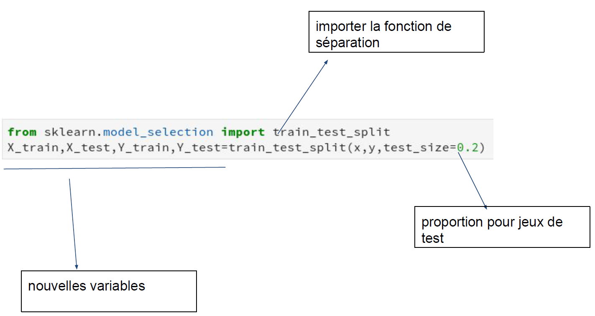

---
  
<!-- *page_number: true -->

## Utilisation de Sklearn pour une régression

 ● Utilise la méthode de descente de gradient pour trouver les bons paramètres
 ● Large collection de modèles statistiques disponibles (random forest, réseaux de neurones..)
 
 Exemple de code :

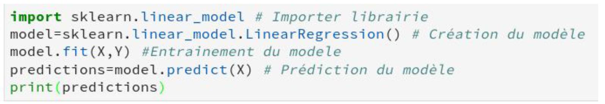

---
  
<!-- *page_number: true -->

## Utilisation de Sklearn pour une classification

 ● Prédiction d’une classe et des probabilités pour chaque classe

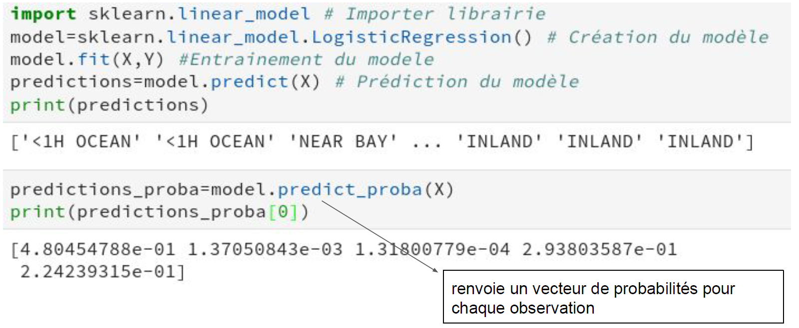 

---
  
<!-- *page_number: true -->

## Travail à réaliser :

 
  
##### ● Entraîner un modèle linéaire

##### ● Evaluer son score

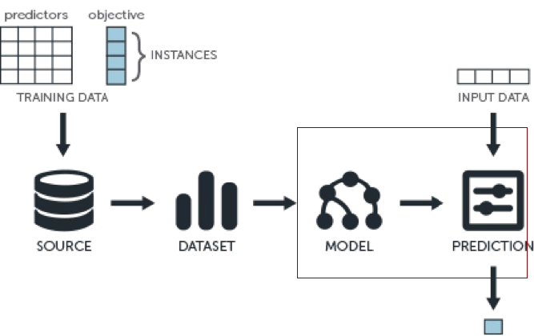

