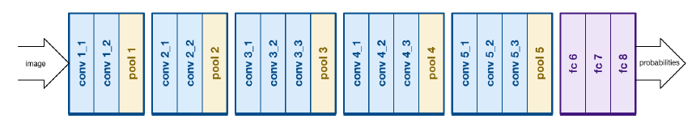
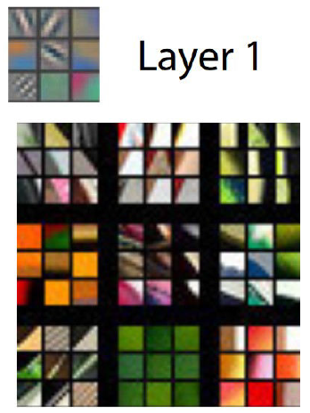
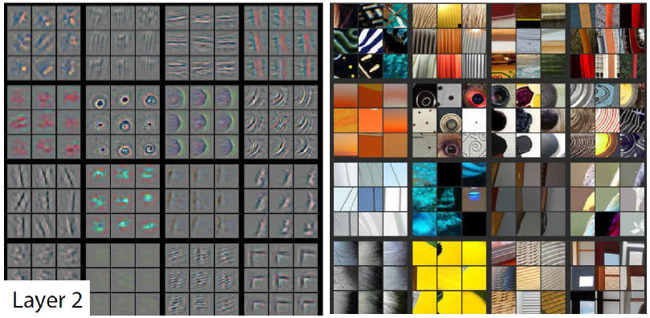
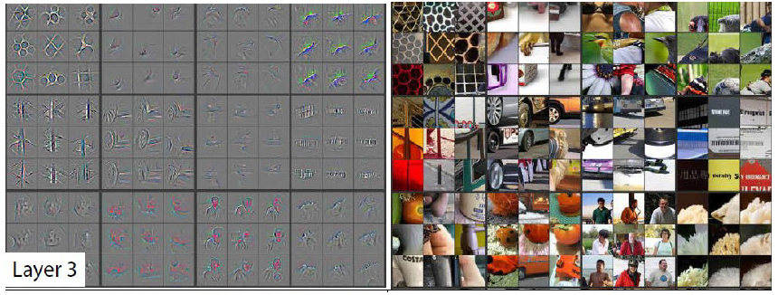
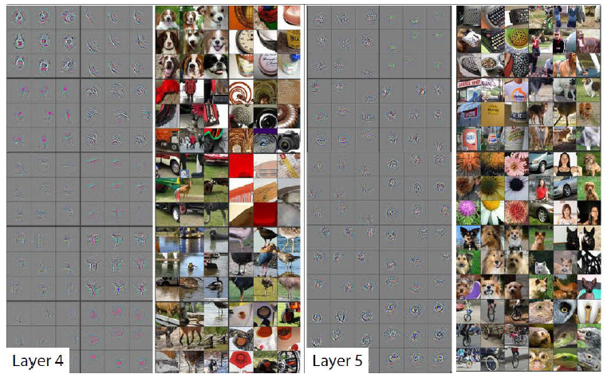
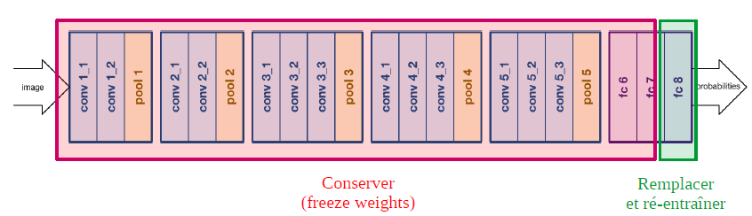

 

<!-- *page_number: true -->

# Deep Learning : Visualisation et *Transfer Learning* 

 

### Présentation partagée sous la licence Apache 2.0

---
  
<!-- *page_number: true -->

## Architecture du classificateur d'images VGG16 

##### 
 Que se passe-t-il dans les différentes couches ? 

---
  
<!-- *page_number: true -->

## Visualizing and Understanding Convolutional Networks (Zeiler & Fregus - 2014) 

 

---
  
<!-- *page_number: true -->

## Visualizing and Understanding Convolutional Networks (Zeiler & Fregus - 2014)

---

<!-- *page_number: true -->

## Visualizing and Understanding Convolutional Networks (Zeiler & Fregus - 2014)

---
  
<!-- *page_number: true -->

## Visualizing and Understanding Convolutional Networks (Zeiler & Fregus - 2014)

---
  
<!-- *page_number: true -->

## Le transfer *Learning*

■ L'idée : réutiliser le travail déjà effectué ! 

- On a un réseau A conçu pour distinguer 1000 classes d'objets, entraîné sur plus d'un million d'images (ImageNet)
- Ses premières couches détectent des propriétés génériques, adaptées à différents types de problèmes
- On veut créer un réseau B pour traiter un nouveau problème. Par exemple classifier différents types de nuages avec peu d'images d'entrainement (quelques milliers)
- On veut donc profiter de l'entraînement du réseau A pour créer le réseau B

---

<!-- *page_number: true -->

## Le *transfer learning* : Comment faire !

■ A partir d'un réseau déjà entrainé sur un autre jeu de données 

■ Remplacer la dernière couche 

- Dans le VGG-16,la dernière couche est une FC_1000 + softMax
- Pour en faire un classificateur binaire, remplacer par FC_1 + sigmoid 
(FC signifie Fully Connected, c'est équivalent à Dense dans Keras)

■ Figer (Freeze) les poids des premières couches 

■ Ré-entrainer sur notre nouveau problème 

---
  
<!-- *page_number: true -->

##### 
 Travaux pratiques : entraîner un classificateur d'images 
 
