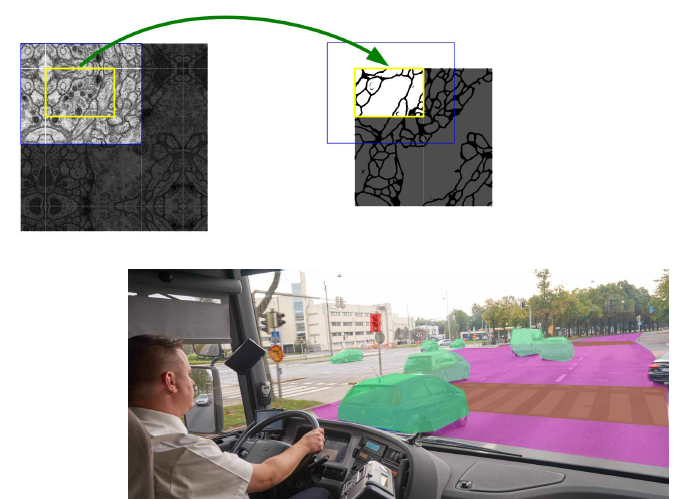
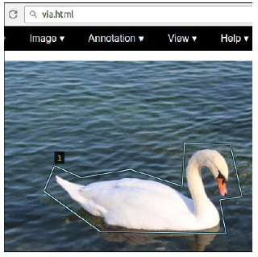

<!-- *page_number: true -->

 

# Deep Learning : Unet - Segmentation d'image

 

### Présentation partagée sous la licence Apache 2.0

---
  
<!-- *page_number: true -->

## Segmenter des images avec un réseau de neurones

Identifier à quel classe appartient chaque pixel

 

 

---

<!-- *page_number: true -->

## L'architecture Unet (Olaf Ronneberger, Philipp Fischer, and Thomas Brox - 2015)  

 

---

<!-- *page_number: true -->

## Labellisation du jeu d'entraînement   

■ Pour labelliser le jeu d'entraînement : outil gratuit VGG Image annotator (VIA)   http://www.robots.ox.ac.uk/~vgg/software/via/

■ Nous allons utiliser cet outil pour 

* Délimiter les différents objets de l'image avec des polygones 
* Exporter un fichier csv contenant les polygones 

 

--- 

<!-- *page_number: true -->

##### 
 Travaux Pratiques : créer et entraîner un Unet 
 
